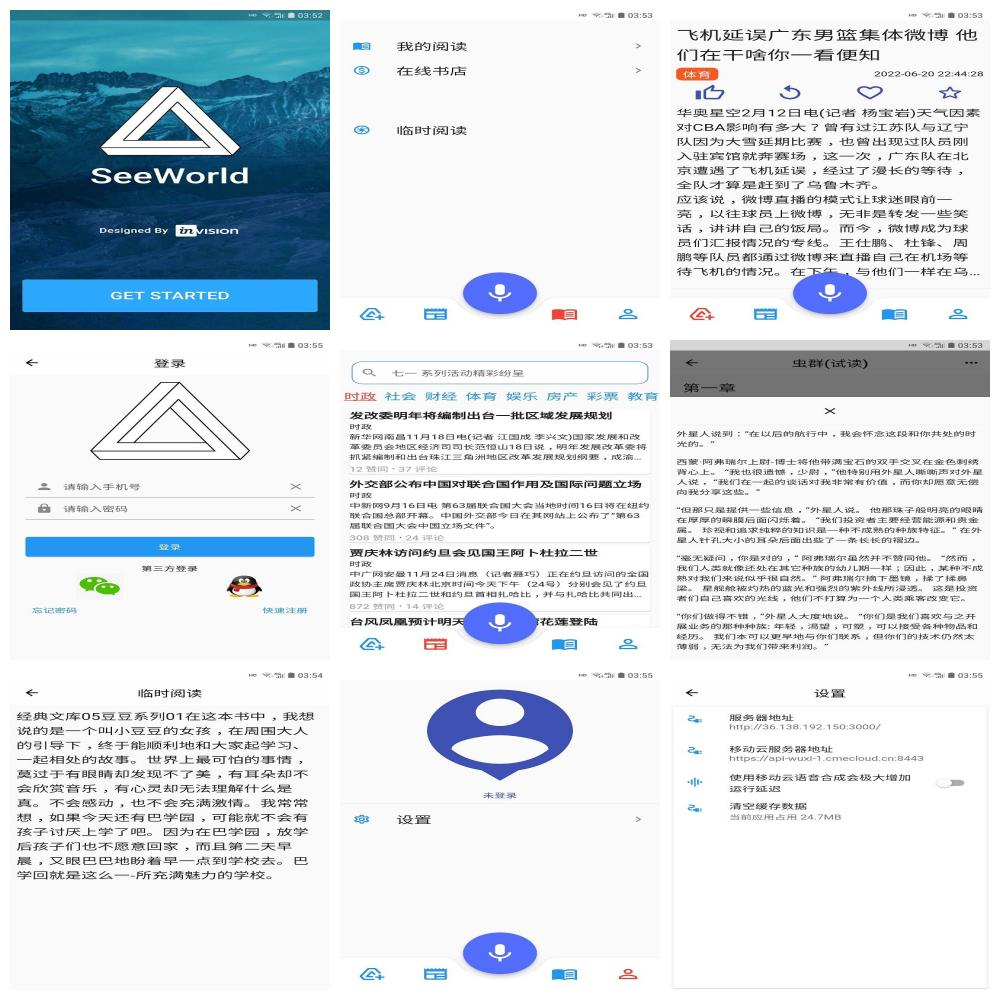

# seeworld_flutter
### Introductions
2022年度中国软件杯大学生软件设计大赛题目：A3-视障人士友好的资讯辅助软件，移动端应用程序设计部分。主要功能包括：
 - 推荐新闻。朗读；滚动未到距离弹回；达到距离全屏翻页；无限刷新；保存浏览位置，返回继续朗读。  
 - 普通新闻。按类型加载新闻(默认5条，不再支持无限刷新)；点击浏览并朗读。  
 - 我的阅读。在本地数据库插入《虫群》试读章节；支持添加电子图书；长按图书可编辑/删除；以底部模态框弹出章节，可滚动浏览并朗读。  
 - 临时阅读。拍照图书转文本朗读。  
 - 设置。登录；设置应用参数。  
 - 语音互交。 关键功能语音路由；简单的机器人聊天(关键词：同学)。  

### Features
移动端应用主要包含功能
 - 基于移动云人工智能平台实现ORC图片文字识别功能  
 - 基于移动云人工智能平台实现语音转文本听写功能  
 - 基于移动云人工智能平台实现在线语音合成功能(延迟较大)  
 - 基于系统原生TTS实现文本转语音合成功能
 - 基于聊天机器人实现基本信息查询及语音互交功能

### Updates
修复getx默认响应超时时间过短，致使无法接收较大OCR响应结果  
基于GetX重构。确实比原生开发简洁了很多  
调用新闻类型接口  
加入加载进度条  
~~基于DIO重构网络处理。取消，使用GetX实现~~  
应用无网络连接弹出警告窗口  
实现基于本地SQLite数据库的图书存储  
首次创建时，默认在本地创建虫群试读章节  
未实现创建章节目录  

### Development Environments
Flutter 2.10.4  
Android SDK 32  
GetX ^4.6.5  
~~dio 4.0.1~~  

### Learning Notes
[home.md](./home.md)

### Screenshot

